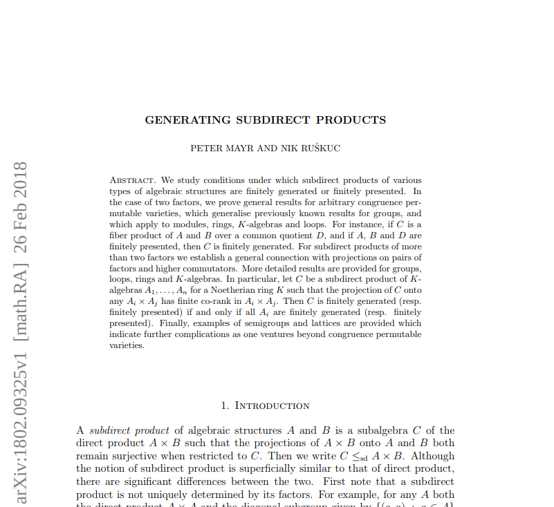

## Kernels of epimorphisms of 
## finitely generated free lattices
 
### William DeMeo$^{†}\;$ Peter Mayr$^{†}\quad$ Nik Ruškuc$^{‡}$

† University of Colorado $\qquad\qquad\qquad$   ‡ University of St Andrews


<!-- View the slides at: https://gitpitch.com/universalalgebra/fg-free-lat/master -->
<!-- ;float: right"/> -->


---

### The Problem

@ul

- Let $X$ be a finite set and $\mathbf F := \mathbf F(X)$ the free lattice generated by $X$.

- Let $\mathbf L = \langle L, \wedge, \vee\rangle$ be a finite lattice and $h\colon \mathbf{F} \twoheadrightarrow \mathbf{L}$ an epimorphism.

- **Question.** When is $\ker h$ finitely generated?

@ulend

---

### Motivation

<!-- 
 -->
Mayr & Ruškuc  
"Generating subdirect products" (2018) 

<br>
<br>
<br>

```bibtex
@misc{1802.09325,
Author = {Peter Mayr and Nik Ruskuc},
 Title = {Generating subdirect products},
  Year = {2018},
Eprint = {arXiv:1802.09325},
   URL = {https://arxiv.org/pdf/1802.09325.pdf}
}
```

---


Let $X$ be a finite set and $\mathbf F := \mathbf F(X)$ the free lattice generated by $X$.

**Conjecture.**
If $\mathbf L = \langle L, \wedge, \vee\rangle$ is finite and $h\colon \mathbf{F} \twoheadrightarrow \mathbf{L}$ is a lattice epimorphism, then 

*$h$ is bounded if and only if $\ker h$ is finitely generated.*

---

#### Proof

($\Rightarrow$) Assume $h$ is bounded.  

For each $y\in L$, let $$\alpha y= \bigvee h^{-1}\{y\} \quad\text{ and } \quad \beta y = \bigwedge h^{-1}\{y\}$$ be the greatest and least elements of $h^{-1}\{y\}$.

Observe,  $\quad h \alpha h = h \quad$ and $\quad h \beta h = h$.

In fact, $\alpha$ and $\beta$ are left/right adjoints of $h$. 

$\quad h x \leqslant y \quad \Longleftrightarrow \quad x \leqslant \alpha y$ 

$\quad y \leqslant h x \quad \Longleftrightarrow \quad \beta y \leqslant x.$

Note: for finite lattices, $h$ bounded simply means the preimage of each $y\in L$ under $h$ is bounded.  

---

For $y \in L$, define

$\quad X_y := X\cap h^{-1}\{y\}$

Let $K$ be the following (finite) set of pairs in $\mathbf F \times \mathbf F$:

$\bigcup_{y \in L}\\{\pmatrix{x\\\ \alpha y},  \pmatrix{\alpha y\\\ x}, \pmatrix{x\\\ \beta y}, \pmatrix{\beta y\\\ x},  \pmatrix{\alpha y\\\ \beta y},  \pmatrix{\beta y\\\ \alpha y} \,: \,x \in X_y\\}.$

**Claim.** $K$ generates $\ker h$.

---

We show, by induction on term complexity:

$\quad (\forall y \in L)\; (\forall r \in h^{-1}\{y\}) 
\quad \bigl\\{\pmatrix{r\\\ \alpha y}, \, \pmatrix{r\\\ \beta y}\bigr\\} \subseteq \langle K \rangle$
 <!-- \leqslant \mathbf F \times \mathbf F$. -->

@ul

+ **Case 0.** If $r \in X$, then $\pmatrix{r\\\ \alpha y}$ and $\pmatrix{r\\\ \beta y}$ belong to $K$ (nothing to prove)

@ulend

---
**Case 1.** Suppose $r = s \vee t$, where

$\bigl\\{\pmatrix{s\\\ \alpha {h(s)}}, \; 
\pmatrix{s\\\ \beta{h(s)}},\, \pmatrix{t\\\ \alpha {h(t)}},\;
\pmatrix{t\\\ \beta{h(t)}}\bigr\\} \subseteq \langle K \rangle \quad \text{(Ind Hyp)}$

Then $y = h (r) = h(s\vee t) = h (s)\vee h(t)$.

∴ $\qquad h(\alpha {h(s)} \vee \alpha {h(t)})= h\alpha h(s) \vee h\alpha h(t)=
h(s) \vee h(t) = y.$

---

Similarly $\qquad h(\beta{h(s)} \vee \beta {h(t)})= h(s) \vee h(t) = y$.

∴ $\qquad \beta y \leqslant \beta h(s) \vee \beta h(t) \leqslant \alpha {h(s)} \vee \alpha {h(t)} \leqslant \alpha y.$

Therefore

<!-- \pmatrix{\alpha y \wedge (s\vee t) \\\ \beta y} -->
$\begin{pmatrix}r \\\ \beta y \end{pmatrix} = 
\pmatrix{\alpha y \wedge (s\vee t)\\\ \beta y \wedge (\beta {h(s)} \vee \beta {h(t)})}$

$\qquad\quad = \pmatrix{\alpha y\\\ \beta y} \wedge 
\left[\pmatrix{s\\\ \beta {h(s)}} \vee \pmatrix{t\\\ \beta {h(t)}}\right]\in \langle K \rangle.$

Note: Also $r \leqslant \alpha y$, so $r = \alpha y \wedge (s\vee t)$.

---

Similarly $\pmatrix{r\\\ \alpha y} \in \langle K \rangle$.

Indeed 

$\qquad \beta y \leqslant r \; \Longrightarrow \; r = \beta y \vee s\vee t$ 

and

$\qquad \beta {h(s)} \vee \beta {h(t)} \leqslant \alpha y \; \Longrightarrow \; \alpha y = \alpha y \vee \beta {h(s)} \vee \beta {h(t)}$

Therefore

$\qquad \pmatrix{r \\\ \alpha y}= 
\pmatrix{\beta y \vee s\vee t \\\ \alpha y \vee \beta {h(s)} \vee \beta {h(t)}}= 
\pmatrix{\beta y\\\ \alpha y} \vee 
\pmatrix{s \\\ \beta {h(s)}}\vee 
\pmatrix{t \\\ \beta {h(t)}}$

---

**Case 2.** $r = s \wedge t$, where

<!-- $\pmatrix{s\\\ \alpha {h(s)}}$, $\pmatrix{s\\\ \beta{h(s)}}$, $\pmatrix{t\\\ \alpha {h(t)}}$, $\pmatrix{t\\\ \beta{h(t)}}$ belong to $\langle K \rangle$.  -->
$\quad \bigl\\{\pmatrix{s\\\ \alpha {h(s)}}, \; \pmatrix{s\\\ \beta{h(s)}}, \; \pmatrix{t\\\ \alpha {h(t)}}, \; \pmatrix{t\\\ \beta{h(t)}}\bigr\\}\, \subseteq \, \langle K \rangle.$

Then $y = h(r) = h(s\wedge t)$,

∴ $\quad h(\beta {h(s)} \wedge\beta {h(t)}) = y = h(\alpha {h(s)} \wedge\alpha {h(t)})$

<!-- and $\beta y \leqslant r \leqslant \alpha y$ so  -->

∴ $\quad \beta y \leqslant \beta h(s) \wedge \beta h(t) \leqslant \alpha {h(s)} \wedge \alpha {h(t)} \leqslant \alpha y.$

<!-- 
$$r = \alpha y \wedge s\wedge t \; \text{ and } \;
r = \beta y \vee (s\wedge t).$$  -->

Therefore,

$\pmatrix{r \\\ \alpha a} = 
\pmatrix{\beta y \vee (s\wedge t) \\\ \alpha y \vee (\alpha {h(s)} \wedge \alpha {h(t)})} = 
\pmatrix{\beta y\\\ \alpha y} \vee
\left[\pmatrix{s \\\ \alpha {h(s)}} \wedge \pmatrix{t \\\ \alpha {h(t)}}\right] \in \langle K \rangle$

<!-- Note: We could have used $\beta$'s instead:
$$\left(\begin{array}{c} r \\ \alpha y\end{array}\right) = 
\left(\begin{array}{c} \beta y \vee (s\wedge t) \\ \alpha y \vee (\beta {h(s)} \wedge \beta {h(t)}) \end{array}\right) = 
\left(\begin{array}{c} \beta y\\ \alpha y\end{array}\right) \vee
\left[\left(\begin{array}{c}s \\ \beta {h(s)}\end{array}\right) \wedge \left(\begin{array}{c}t \\ \beta {h(t)} \end{array}\right)\right].$$

Note: Similarly,
$$\left(\begin{array}{c} r \\ \beta y\end{array}\right) = 
\left(\begin{array}{c} \alpha y \wedge s\wedge t \\ \beta y \wedge \alpha {h(s)} \wedge \alpha {h(t)} \end{array}\right) = 
\left(\begin{array}{c} \alpha y\\ \beta y\end{array}\right) \wedge 
\left(\begin{array}{c}s \\ \alpha {h(s)}\end{array}\right) \wedge \left(\begin{array}{c}t \\ \alpha {h(t)} \end{array}\right).$$

Note:
Again, we could have used $\beta$'s instead:
$$\left(\begin{array}{c} r \\ \beta y\end{array}\right) = 
\left(\begin{array}{c} \alpha y \wedge s\wedge t \\ \beta y \wedge \beta {h(s)} \wedge \beta {h(t)} \end{array}\right) = 
\left(\begin{array}{c} \alpha y\\ \beta y\end{array}\right) \wedge 
\left(\begin{array}{c}s \\ \beta {h(s)}\end{array}\right) \wedge \left(\begin{array}{c}t \\ \beta {h(t)} \end{array}\right).$$

Note: In each case, we end up with an expression involving terms from $\langle K \rangle$, and this proves that $(r, \alpha y)$ and $(r, \beta y)$ belong to $\langle K \rangle$. -->

---


---

#### Proving the converse of the conjecture

Suppose $h$ is not lower bounded. 

**To Show:** $\ker h$ is not finitely generated.

---

### Detour into "real" lattice theory

Let **FJN** =
```bibtex
@book {MR1319815,
    AUTHOR = {Freese, Ralph and Je{\v z}ek, Jaroslav and Nation, J.~B.},
     TITLE = {Free lattices},
    SERIES = {Mathematical Surveys and Monographs},
    VOLUME = {42},
 PUBLISHER = {American Mathematical Society, Providence, RI},
      YEAR = {1995},
     PAGES = {viii+293},
      ISBN = {0-8218-0389-1},
   MRCLASS = {06B25 (06-02 06-04 06B20 68Q25)},
  MRNUMBER = {1319815 (96c:06013)},
MRREVIEWER = {T. S. Blyth},
       DOI = {10.1090/surv/042},
       URL = {http://dx.doi.org/10.1090/surv/042},
}
```

---

#### The closure operators $(^\wedge$_$^\vee)$

**FJN** defines a pair of closure operators on subsets of lattices as follows: 

$$A^\wedge = \\{\bigwedge B : B \text{ is a finite subset of } A\\}.$$


$A^\vee$ is defined dually.

+ If $\mathbf L = \langle L, \vee, \wedge\rangle$ is a lattice 
  generated by a finite set $X$, then $L$ is a union of the chain $H_0\subseteq H_1 \subseteq \cdots$, defined inductively as: 
  + $H_0 = X^\wedge$ 
  + $H_{k+1} = (H_k)^{\vee \wedge}$ $\quad(k\geqslant 0)$ 

+ Each $H_n = (X^{\wedge})^{(\vee\wedge)^n}$ is a finite meet-closed subset of $L$, and $\bigcup H_n = L$.

Note: If $\mathbf L$ has a top, $1_{\mathbf L}$, let $\bigwedge \emptyset = 1_{\mathbf L} \in A^\wedge$. Otherwise, $\bigwedge \emptyset$ is undefined. 

---

#### alpha beta sequences
Let $h \colon \mathbf L \to \mathbf L'$ be a lattice epimorphism.

For each $y \in L'$ and $k< \omega$, define
$$\beta_k(y) = \bigwedge \\{w \in H_k : h(w) \geqslant a\\}.$$

**FJN** (p. 30) 
  
  "...[$h$ is lower bounded] iff
  for each $a \leqslant h(1_{\mathbf L})$ there exists $N\in \omega$ such that $\beta_n(a) = \beta_N(a)$ for all $n\geqslant N$..."

Equivalently, $h$ is *not* lower bounded iff 

  † $\quad (\,\exists a \in L\,) \; (\,\forall N<\omega\,) \; (\,\exists n> N\,) \;\; \beta_n(a) \neq \beta_N(a)$.

  iff

  ‡ 
  $\quad (\exists a\in L) (\forall n>0) \beta\_n(a) >\beta\_{n+1}(a)$.


---

#### (alleged) proof of converse of conjecture

Suppose $h$ is not lower bounded. 

**To Show:** $\ker h$ is not finitely generated.

Let $y_0\in L$ satisfy $\beta_0y_0 > \beta_1y_0 > \beta_2y_0 > \cdots$ 

(an infinite descending chain) 

Let $K$ be a finite subset of $\ker h$, say, 

$\bigl\\{\pmatrix{p\_1 \\\ q\_1}, \dots, \pmatrix{p\_{m}\\\ q\_{m}}\\} \subseteq \ker h$.

We prove $\langle K \rangle \neq \ker h$. 

Note: since $K$ is an arbitrary finite subset of $\ker h$, this will prove $\ker h$ is not finitely generated.

---

### the gap

*With loss of generality*

suppose $\exists x_0\in X$ of $\mathbf F$ in an unbounded class $h^{-1}\{y_0\}$. 
<!-- (ie, $h(x_0) = y_0$). -->

**Claim 1.** $(\exists N<\omega) \; \bigl(\forall \pmatrix{p_i\\\ q_i}\in K\bigr)\;
\bigl(p_i \geqslant x_0 \; \Longrightarrow \; q_i \geqslant \beta_N (y_0)\bigr)$.

**Proof.** Fix $i$ and $\pmatrix{p_i\\\ q_i} \in K$. 
<!-- (so, $h(p_i) = h(q_i)$).  -->

Define $N_i$ as follows:

+ **Case 0.** If $p_i \ngeqslant x_0$, let $N_i = 0$.  

+ **Case 1.** If $p_i\geqslant x_0$.

---  

#### Case 1. 

**Assume:** $p_i\geqslant x_0$

Then $x_0 = x_0\wedge p_i$

  $\quad\text{ so } y_0 = h(x_0) = h(x_0) \wedge h(p_i) \leqslant h(p_i)$ 
  
  $\quad\text{ so } y_0\leqslant h(q_i)$. 
  
  Also, $h(x_0 \wedge q_i) = h(x_0) \wedge h(q_i) = y_0$ 
  
  $\quad\text{ so } x_0\wedge q_i \in h^{-1}\{y_0\}$ 
  
  $\quad\text{ so } (\exists n>0) \, (x\_0 \wedge q\_i \geqslant\beta\_{n}y\_0)$. 
  
  Let $N\_i = n\_i$ (so $q\_i \geqslant \beta\_{N\_i}y\_0$).
<!-- Therefore (since $\{\beta_i y_0\}$ is an infinite descending chain in $h^{-1}\{y_0\}$) -->

---

#### A single $N$ for all (alleged) generators

$K$ is finite, so find such $N_i$ for each $\pmatrix{p_i\\\ q_i} \in K$. 

Let $N = \max\{N_i : 1 \leqslant i \leqslant m\}$.  Then for all $1\leqslant i \leqslant m$

$(\star)  \qquad \qquad \qquad \qquad \qquad p_i \geqslant x_0 \quad \Longrightarrow \quad q_i \geqslant \beta_N(y_0).$

This completes the proof of Claim 1.

-----


**Claim 2.** $(\exists N < \omega) \, \bigl(\forall \pmatrix{p\\\ q} \in \langle K \rangle\bigr)$

$(\ast) \quad \qquad p \geqslant x_0 \quad \Longrightarrow \quad q \geqslant \beta_N(y_0).$

<!-- we have
$$
(\ast) \qquad \qquad \text{if } p \geqslant x_0, \text{ then $q \geqslant \beta_N(y_0)$}
$$ -->
**Proof.**  Choose $N$ as in proof of Claim 1, so ($\ast$) holds for $\pmatrix{p\\\ q} \in K$. 

Fix $\pmatrix{p\\\ q} \in K$. We prove ($\ast$) by induction on complexity of 
$\pmatrix{p\\\ q}$.  

---

**Case 0.** $\pmatrix{p\\\ q}\in K$ (nothing to prove)

**Case 1.** Assume $\pmatrix{p\\\ q}= \pmatrix{p_1\\\ q_1}\wedge \pmatrix{p_2\\\ q_2}$ where $p_i$, $q_i$  satisfy ($\ast$). 

Assume: $p\geqslant x_0.\qquad$  To show: $q \geqslant \beta_N(y_0)$

Observe: $p = p_1 \wedge p_2 \geqslant x_0.\qquad$ ∴ $p_1 \geqslant x_0$ and $p_2 \geqslant x_0$.

$∴\quad \text{ (IH) } \quad \Longrightarrow \quad q_1\geqslant \beta_N(y_0), \quad q_2\geqslant \beta_N(y_0).$ 

Therefore, $q = q_1 \wedge q_2 \geqslant \beta_N(y_0)$.

---

**Case 2.** Assume $\pmatrix{p\\\ q}= \pmatrix{p_1\\\ q_1}\vee \pmatrix{p_2\\\ q_2}$ where $p_i$, $q_i$  satisfy ($\ast$). 

Assume: $p\geqslant x_0$. <!-- (We show $q \geqslant \beta_N(y_0)$.)--> 

Observe: $p = p_1 \vee p_2 \geqslant x$.  

Since $x_0$ is a generator, it is join prime in $\mathbf{F}(X)$, so either $p_1 \geqslant x_0$ or $p_2 \geqslant x_0$.  

If $p_1 \geqslant x_0$, then IH implies $q_1\geqslant \beta_N(y_0).$

Therefore, $q = q_1 \vee q_2 \geqslant q_1 \geqslant \beta_N(y_0)$.

---

**Claim 3:** $K$ does not generate $\ker h$.

**Proof.** Chose $N$ as in proof of Claim 2.  

$\beta_0y_0 > \beta_1y_0 > \cdots$ is an infinite descending chain. 

In particular $\beta_{N}y_0 > \beta_{N+1}y_0$. 


$∴\quad \pmatrix{x_0\\\ \beta_{N+1} y_0} \in \ker h \setminus \langle K\rangle$.

Since $K$ was an arbitrary finite subset of $\ker h$, we're done.

---

### Examples

Let $\mathbf{M_3} = \langle \{0, a, b, c, 1\}, \wedge, \vee\rangle$, where 

$a \wedge b = a \wedge c = b \wedge c = 0$ and $a \vee b = a \vee c = b \vee c = 1.$ 

Let $\mathbf F := \mathbf F(x, y, z)$ denote the free lattice generated by $\{x, y, z\}$.

**Proposition.**
If $h\colon \mathbf{F} \twoheadrightarrow \mathbf{M_3}$ is generated by $x\mapsto a$, $y\mapsto b$, $z\mapsto c$, then $\operatorname{ker} h$ is not finitely generated.
<!--If $K = \operatorname{ker}\left(\mathbf{F}\{x, y, z\} \twoheadrightarrow \mathbf{M_3}\right)$, then $K$ is not finitely generated.   -->


---

#### Proof of Proposition
Define

- $\eta := \operatorname{ker} h$.

- $C_u := u/\eta := \{v \in F : h(v) = h(u)\}\qquad$ $(u \in \{x, y, z\})$

- $\{m_{u,i} : i<\omega\}$, by mutual recursion:

  $m_{0, i} = (m_{x,i} \wedge m_{y,i}) \vee (m_{x,i} \wedge m_{z,i})\vee (m_{y,i} \wedge m_{z,i})$;

  + $m_{u,0} = u$,  
    $m_{u, i+1} = m_{u, i}\vee m_{0,i}\qquad$ $(u \in \{x, y, z\})$

---

#### Two key lemmas 

+ **Lemma 1.** For $u \in \{0, x, y, z\}$, the sequence $\{m_{u,n} : n < \omega\}$ 
  is strictly ascending: 

  $m_{u,0} < m_{u,1} < m_{u,2} < \cdots$

+ **Lemma 2.** $(\forall u \in \{x, y, z\}) \, (\forall p \in C_u \cup C_0)$ 

  $\qquad (\exists n <\omega) \quad p\leqslant m_{u,n}$  

Proofs available at 

https://github.com/UniversalAlgebra/fg-free-lat

---

<!-- Notice that
$m_{0, 0} = (x\wedge y) \vee (x\wedge z)\vee (y\wedge z)$ and $m_{x, i+1} = m_{x,i} \vee (m_{y,i} \wedge m_{z,i})$.   -->
#### Back to proof of proposition

**Assume:** $K$ is a finite subset of $\eta$ 

**To Show:** $\exists \pmatrix{p\\\ q} \in \eta \setminus \langle K \rangle$  

Fix $u\in \{0, x, y, z\}$. 

Since $K$ finite, there exists $\exists M < \omega$ such that for all
$\pmatrix{p\\\ q} \in K$

$p, q \in C_u \quad \Longrightarrow \quad \pmatrix{p\\\ q} \leqslant m_{u, M}$.

---

**Claim.** For $\pmatrix{p\\\ q} \in \langle K \rangle$ and $u \in \{x, y, z\}$, the following implication holds:

$(\star) \quad \qquad q \leqslant u \quad \Longrightarrow \quad p\leqslant m_{u, M}$.

**Proof.** (by induction on term complexity)

Fix $\pmatrix{p\\\ q} \in \langle K \rangle$. Then $p, q \in C_u$ for some $u\in \{x, y, z\}$.

+ **Case 0.** $\pmatrix{p\\\ q}\in K$. Then by definition of $M$ we have $p, q \leqslant m_{u, M}$.

---

+ **Case 1.** $\pmatrix{p\\\ q} = \pmatrix{p_1\\\ q_1} \wedge \pmatrix{p_2\\\ q_2}$, where each $\pmatrix{p_1\\\ q_1}$ satisfies ($\star$).

  *Assume:* $q= q_1 \wedge q_2 \leqslant u$.
  
  *Observe:* $q_1\leqslant u$ or $q_2\leqslant u$ (generators of free lattice are $\wedge$-prime) 
  
  Assume $q_1\leqslant u$.
  
  $\quad \text{ (IH) } \quad \Longrightarrow \quad p_1\leqslant m_{uM}\quad \Longrightarrow \quad p = p_1\wedge p_2 \leqslant m_{uM}$.

---

+ **Case 2.** 
  $\pmatrix{p\\\ q} = \pmatrix{p_1\\\ q_1} \vee \pmatrix{p_2\\\ q_2}$,
  where each $\pmatrix{p_i\\\ q_i}$ satisfies ($\star$).
  
  *Assume:* $q= q_1 \vee q_2 \leqslant u$.

  *Observe:* $q_i \leqslant u$ for $i = 1, 2$.

  $∴\quad \text{ (IH) } \quad \Longrightarrow \quad p_1,p_2 \leqslant m_{u,M} \quad \Longrightarrow \quad p = p_1\vee p_2 \leqslant m_{u,M}$.
  
From the claim just proved, and [Lemma 1](#lemma-1), 

$\pmatrix{m_{x, M+1}\\\ x}\in \eta \setminus \langle K \rangle$.

∎
---


 <!-- style="width: 600px"/> -->


---

##### Lemma 1
For each $u \in \{0, x, y, z\}$, the sequence $\{m_{u,n} : n \in \mathbb N\}$ is a strictly ascending chain; that is, $m_{u,0} < m_{u,1} < m_{u,2} < \cdots$.  

**Proof.**    
+ *Case:* $u \in \{x, y, z\}$.    
  For simplicity, assume $u = x$ for the remainder of the proof of this case.  (Of course, the same argument goes through when $u$ is $y$ or $z$.) Fix $n \in \mathbb N$.  We will prove $m_{x,n} < m_{x,n+1}$.

  *Subclaim.* For all $n\in \mathbb N$,
  1. $m_{x,n}\in C_x$, 
  2. $m_{x,n}\ngeq y$, and $m_{x,n}\ngeq z$.

  The first subclaim is obvious. For the second, if $m_{x,n}\geqslant y$, then $m_{x,n}\wedge y = y$, and then $0 = h(m_{x,n}\wedge y) = h(y) = b$.  A similar contradiction is reach if we assume $m_{x,n}\geqslant z$, so the subclaim is proved.

  Recall, $m_{x, n} = m_{x,n} \vee (m_{y,n} \wedge m_{z,n})$, so our desired conclusion, $m_{x,n} < m_{x,n+1}$, holds unless 
  $m_{x,n} \geqslant m_{y,n} \wedge m_{z,n}$.

  So, by way of contradiction, suppose 

  (‡)  $\qquad m_{x,n} \geqslant m_{y,n} \wedge m_{z,n}$.

  Now, $m_{y,n} = y \vee (x \wedge z) \vee \cdots$, so clearly $m_{y,n} \geqslant y$.  Similarly, $m_{z,n} \geqslant z$.
  This, together with (‡), implies $m_{x,n} \geqslant m_{y,n} \wedge m_{z,n} \geqslant y \wedge z$.  But then Theorem 1.11 below implies that either $m_{x,n} \geqslant y$ or $m_{x,n} \geqslant z$, which contradicts Subclaim 2 above.

+ *Case:* $u = 0$.  
  We first prove that $m_{0, 0} = (x\wedge y) \vee (x\wedge z)\vee (y\wedge z)$ is strictly below $m_{0, 1} = 
  (m_{x,1}\wedge m_{y,1}) \vee (m_{x,1}\wedge m_{z,1}) \vee (m_{y,1}\wedge m_{z,1})$.

  By symmetry, it suffices to show $x\wedge y < m_{x,1}\wedge m_{y,1}$;
  that is, $x\wedge y < (x \vee (y\wedge z))\wedge (y \vee (x\wedge z))$.

  Clearly 
  $x\wedge y \leqslant (x \vee (y\wedge z))\wedge (y \vee (x\wedge z))$. Suppose $x\wedge y = (x \vee (y\wedge z))\wedge (y \vee (x\wedge z))$. Then $(x \vee (y\wedge z))\wedge (y \vee (x\wedge z))\leqslant x$.
  By Theorem 1.11, the latter holds iff
  $x \vee (y\wedge z)\leqslant x$ or
  $y \vee (x\wedge z)\leqslant x$
  The first of these inequalities is clearly false, so it must be the case that $y \vee (x\wedge z)\leqslant x$.  But then $y \leqslant x$, which is obviously false.  We conclude that
  $x\wedge y <(x \vee (y\wedge z))\wedge (y \vee (x\wedge z))$.

  This proves $m_{0,0} < m_{0,1}$.

  Now fix $n\in \mathbb{N}$ and assume $m_{0,n} < m_{0,n+1}$.
  We show $m_{0,n+1} < m_{0,n+2}$.

  (**To do:** complete the proof in this case; i.e., for $u = 0$.)

  **--scratch work--**

  $m_{0, n} := (m_{x,n} \wedge m_{y,n}) \vee (m_{x,n} \wedge m_{z,n})\vee (m_{y,n} \wedge m_{z,n})$,

  $m_{0, n+1} := (m_{x,n+1} \wedge m_{y,n+1}) \vee (m_{x,n+1} \wedge m_{z,n+1})\vee (m_{y,n+1} \wedge m_{z,n+1})$,

  By the first Case above, $m_{u,n} < m_{u,n+1}$.

---

##### Lemma 2
For each $u \in \{x, y, z\}$, for each $p \in C_u \cup C_0$, there exists $n \in \mathbb N$ such that $p\leqslant m_{u,n}$.  
*Proof.* (By induction on the complexity of $p$.)  

+ *Case:* $p\in \{x, y, z\}$. Then $u = p = m_{p,0}$.

For the remaining cases assume $u = x$, without loss of generality.

+ *Case:* $p = p_1 \vee p_2$.  
  If $p \in C_x\cup C_0$, then $p_i \in C_x \cup C_0$ for $i = 1, 2$, and 
  the induction hypothesis yields $i$ and $j$ for which $p_1 \leqslant m_{x, i}$ and $p_2 \leqslant m_{x, j}$. Letting $n = \max\{i, j\}$, we have 
  $p_1, p_2 \leqslant m_{x, n}$, from which 
  $p = p_1 \vee p_2 \leqslant m_{x, n}$, as desired.

+ *Case:* $p = p_1 \wedge p_2$.  
  If $p \in C_x$, then we may assume $p_1 \in C_x$ and $p_2 \in C_x \cup C_0$. By the induction hypothesis, there exists $n\in \mathbb N$ such that $p_1 \leqslant m_{x, n}$, whence $p \leqslant p_1 \leqslant m_{x,n}$.

  If $p \in C_0$, then each $p_i$ belongs to $C_u \cup C_0$ for some $u\in \{x, y, z\}$.  If $p_1 \in C_x \cup C_0$, then $p_1 \leqslant m_{x, n}$, as above and we're done.  Similarly, if $p_2 \in C_x \cup C_0$.  So assume $p_1 \in C_y \cup C_0$ and $p_2 \in C_z \cup C_0$. Then the induction hypothesis implies that there exist $i$ and $j$ such that 
  $p_1 \leqslant m_{y, i}$ and $p_2 \leqslant m_{z, j}$. If $n = \max\{i, j\}$, then
  $p_1 \leqslant m_{y, n}$ and $p_2 \leqslant m_{z, n}$.  Then, by the above definition of the sequences, we have
  $p_1 \wedge p_2 \leqslant m_{y, n} \wedge m_{z, n} \leqslant m_{0,n} \leqslant m_{x,n+1}$.

---
---

#### Other Examples  
In each of the examples below, $X$ is a finite set and 
$\mathbf{F} = \mathbf{F}(X)$ is the free lattice generated by $X$.
The symbol $F$ denotes the universe of $\mathbf{F}$. 
+ **Ex 1.** Let $X = \{x,y,z\}$, and let $\mathbf{L} = \mathbf{2}$ be the 2-element chain.    
Then the kernel of an epimorphism $h\colon \mathbf{F} \twoheadrightarrow \mathbf{L}$ is a finitely generated sublattice of $\mathbf{F} \times \mathbf{F}$.
+ **Ex 2.** Let $X = \{x, y, z\}$ and let $\mathbf{L} = \mathbf{3}$ be the 3-element chain.    
Then the kernel of an epimorphism $h\colon \mathbf{F} \twoheadrightarrow \mathbf{L}$ is finitely generated.
+ **Ex 4.** Let $n > 2$, $X = \{x_0, x_1,\dots, x_{n-1}\}$, and $\mathbf{L} = \mathbf{2} \times \mathbf{2}$.  
Let $h\colon \mathbf{F} \twoheadrightarrow \mathbf{L}$ be an epimorphism. Then $\eta = \operatorname{ker}h$ is finitely generated.  

**Proof of Ex 4.**   
Let the universe of $\mathbf{L} = \mathbf{2} \times \mathbf{2}$ be $\{0, a, b, 1\}$, where $a\vee b = 1$ and $a\wedge b = 0$.  

For each $y \in L$, denote by $X_y = X \cap h^{-1}\{y\}$ the set of generators mapped by $h$ to $y$. 

Denote the least and greatest elements of $h^{-1}\{y\}$ (if they exist) by $\ell_y$ and $g_y$, respectively.  For example, 

$\ell_a = \bigwedge h^{-1}\{a\} = \bigwedge \{x\in F: h(x) = a\},\;$ $\quad g_b = \bigvee \{x\in F : h(x) = b\},\quad$ etc. 

In the present example, the least and greatest elements exist is each case, as we now show.

**Claim 1.** $h^{-1}\{a\}$ has least and greatest elements, namely $\ell_a = \bigwedge (X_a \cup X_1)$ and $g_a = \bigvee (X_a\cup X_0)$, resp.  (Similarly, 
$h^{-1}\{b\}$ has least and greatest elements, $\ell_b$ and $g_b$.)

**Claim 2.** $h^{-1}\{0\}$ has least and greatest elements, 
namely, $\ell_0 = \bigwedge X$ and $g_0 = g_a \wedge g_b$, resp.

**Claim 3.** $h^{-1}\{1\}$ has least and greatest elements, namely $\ell_1 = \ell_a \vee \ell_b$ and $g_1 = \bigvee X$, resp.

---

**Proof of Claim 1.**
Let $M(a):=\bigwedge (X_a\cup X_1)$ and $J(a):=\bigvee (X_a\cup X_0)$ and 
note that these values exist in $F$, since the sets involved are finite. Also, 
Then $h(M(a)) = a = h(J(a))$.

Fix $r \in h^{-1}\{a\}$.  

+ *Case:* $r \in X_a$.  
   Then $r\geqslant \bigwedge X_a \geqslant \bigwedge (X_a\cup X_1) = M(a)$.

+ *Case:* $r = s \vee t$, where $h(s) = a$ and $h(t) \in \{a, 0\}$.  
Assume (the induction hypothesis) that $s \geqslant M(a)$. Then 
$r = s\vee t \geqslant M(a)$.

+ *Case:* $r = s \wedge t$, where $h(s) = a$ and $h(t) \in \{a, 1\}$.  
Assume (the induction hypothesis) that $s, t \geqslant M(a)$. 
Then $s \wedge t \geqslant M(a)$.

This proves that for each $r \in h^{-1}\{a\}$ we have $r \geqslant M(a)$, and 
as we noted at the outset, $M(a)\in h^{-1}\{a\}$. Therefore, $\ell_a = M(a)$ is the least element of $h^{-1}\{a\}$.

Similarly, every $r \in h^{-1}\{a\}$ is below $J(a)$, so $g_a = J(a)$.  The proofs of $\ell_b = M(b)$ and $g_b = J(b)$ are similar.

---

**Proof of Claim 2.**   
$\ell_0 = \bigwedge X$ is obvious, so we need only verify that $g_0 = g_a \wedge g_b$. 

Observe that $h(g_a \wedge g_b) = h(g_a) \wedge h(g_b) = a \wedge b = 0$, so 
$g_a \wedge g_b \in h^{-1}\{0\}$. It remains to prove that $r \leqslant g_a \wedge g_b$ holds for all $r \in h^{-1}\{0\}$.

Fix $r \in h^{-1}\{0\}$. Then $h(r \vee g_a) = h(r) \vee h(g_a) = 0 \vee a = a$, which places $r \vee g_a$ in $h^{-1}\{a\}$.  Therefore, 
by maximality of $g_a$, we have $r \vee g_a  \leqslant g_a$, whence 
$r\leqslant g_a$.  Similarly, $r\leqslant g_b$.

---

**Proof of Claim 3.**  
$g_1 = \bigvee X$ is obvious, so we need only verify that $\ell_1 = \ell_a \vee \ell_b$. 

Observe that $h(\ell_a \vee \ell_b) = h(\ell_a) \vee h(\ell_b) = a \vee b = 1$, so 
$\ell_a \vee \ell_b \in h^{-1}\{1\}$. It remains to prove that $r \geqslant \ell_a \vee \ell_b$ holds for all $r \in h^{-1}\{1\}$.

Fix $r \in h^{-1}\{1\}$. Then $h(r \wedge \ell_a) = h(r) \wedge h(\ell_a) = 1 \wedge a = a$, which places $r \wedge \ell_a$ in $h^{-1}\{a\}$.  Therefore, 
by minimality of $\ell_a$, we have $r \wedge \ell_a  \geqslant \ell_a$, whence 
$r\geqslant \ell_a$.  Similarly, $r\geqslant \ell_b$.

---

Now let $Y = \{(x, g_p), (g_p, x), (x, \ell_p),(\ell_p, x) : p \in \{0, a, b, 1\}, x \in X_p\}$.

**Claim 4.** If $r \in F$ and $h(r) = p$, then $(r, \ell_p), (r, g_p) \in \langle Y \rangle$.

**Proof.**  
*Case 0.* If $r \in X_p$, then the pair belongs to $Y$ and the claim is trivial.

*Case 1.* Suppose $r = s \wedge t$.
+ *Subcase 1.1.*   
  $h(r) = 1$ implies $h(s) = h(t) = 1$.  If we assume (the induction hypothesis) that $(s, \ell_1), (s, g_1), (t, \ell_1), (t, g_1)$ belong to $\langle Y \rangle$, then $(r, \ell_1) = (s \wedge t, \ell_1) =  (s, \ell_1) \wedge (t, \ell_1) \in \langle Y \rangle$. 
  
+ *Subcase 1.2.*   
  $h(r) = a$ implies (wlog) $h(s) = a$ and $h(t) \in \{a, 1\}$.  Assume (the induction hypothesis) that $(s, \ell_a), (s, g_a), (t, \ell_p), (t, g_p)$ belong to $\langle Y \rangle$. By Claim 1, $\ell_a \leqslant \ell_1$, so $\ell_a = \ell_a \wedge \ell_1$.
  - If $h(t) = 1$, then $(r, \ell_a) = (s \wedge t, \ell_a \wedge \ell_1) =  (s, \ell_a) \wedge (t, \ell_1) \in \langle Y \rangle$.
  - If $h(t) = a$, then $(r, \ell_a) = (s \wedge t, \ell_a \wedge \ell_a) =  (s, \ell_a) \wedge (t, \ell_a) \in \langle Y \rangle$.
  
+ *Subcase 1.3.*   
  $h(r) = 0$ implies (wlog) that either (i) $h(s) = 0$, or (ii) $h(s) = a$, $h(t)=b$.  
  If $h(s) = 0$, then $(s, \ell_0) \in \langle Y \rangle$ implies 
  $(r, \ell_0) = (s \wedge t, \ell_0) =  (s, \ell_0) \wedge (t, \ell_p) \in \langle Y \rangle$. If 
  If $h(s) = a$, $h(t) = b$, and
  $(s, \ell_a), (t, \ell_b) \in \langle Y \rangle$, then
  $(r, \ell_0) = (s \wedge t, \ell_0) =  (s, \ell_a) \wedge (t, \ell_b) \in \langle Y \rangle$.
  
+ Similarly, in each of the Subcases 1.1--1.3, we have $(r, g_p) \in \langle Y \rangle$.

*Case 2.* Suppose $r = s \vee t$.
+ *Subcase 2.1.*   
  $h(r) = 0$ implies $h(s) = h(t) = 0$.  If we assume (the induction hypothesis) that $(s, \ell_p), (s, g_p), (t, \ell_p), (t, g_p)$ belong to $\langle Y \rangle$, then $(r, \ell_p) = (s \vee t, \ell_p) =  (s, \ell_p) \vee (t, \ell_p) \in \langle Y \rangle$. 
+ *Subcase 2.2.*   
  $h(r) = a$ implies (wlog) $h(s) = a$ and $h(t) \in \{a, 0\}$.  If we assume (the induction hypothesis) that $(s, \ell_p), (s, g_p), (t, \ell_p), (t, g_p)$ belong to $\langle Y \rangle$, then $(r, \ell_p) = (s \vee t, \ell_p) =  (s, \ell_p) \vee (t, \ell_p) \in \langle Y \rangle$. 
+ *Subcase 2.3.*   
  $h(r) = 1$ implies (wlog) that either (i) $h(s) = 1$, or (ii) $h(s) = a$, $h(t)=b$.  
  - If $h(s) = 1$, then $(s, \ell_1) \in \langle Y \rangle$ implies 
  $(r, \ell_1) = (s \vee t, \ell_1) =  (s, \ell_1) \vee (t, \ell_p) \in \langle Y \rangle$.
  - If $h(s) = a$, $h(t) = b$, and
  $(s, \ell_a), (t, \ell_b) \in \langle Y \rangle$, then
  $(r, \ell_1) = (s \vee t, \ell_1) =  (s, \ell_a) \vee (t, \ell_b) \in \langle Y \rangle$.

+ Similarly, in each of the Subcases 2.1--2.3, we have $(r, g_p) \in \langle Y \rangle$.

---

### Appendix 
Here are some useful definitions and results from the Free Lattices book by Freese, Jezek, and Nation.

**Definition.** (length of a term) Let $X$ be a set. Each element of $X$ is a term of length 1, also known as a *variable*. If $t_1, \dots, t_n$ are terms of 
lengths $k_1, \dots, k_n$, then $t_1 \vee \cdots \vee t_n$ and 
$t_1 \wedge \cdots \wedge t_n$ are both terms of length $1+ k_1 + \cdots + k_n$.

**Examples.** By the above definition, the terms 

$x \vee y \vee z \qquad x \vee (y \vee z) \qquad (x \vee y) \vee z$

have lengths 4, 5, and 5, respectively. Reason: variables have length 1, so $x \vee y \vee z$ has length $1 + 1 + 1 + 1$.  On the other hand, $x\vee y$ is a term of length $3$, so $(x \vee y) \vee z$ has length $1 + 3 + 1$. Similarly, 
$x \vee (y \vee z)$ has length $1 + 1 + 3$.

**Lemma 1.2.** Let $\mathcal{V}$ be a nontrivial variety of lattices and let $\mathbf{F}_{\mathcal V}(X)$ be the relatively free lattice in $\mathcal V$ over $X$.  Then,

(\star)  $\quad \bigwedge S \leqslant \bigvee T$ implies $S \cap T \neq \emptyset$ for each pair of finite subsets $S, T \subseteq X$.

---

**Lemma 1.4.** Let $\mathbf L$ be a lattice generated by a set $X$ and let $a \in L$.  Then 
+ (1) if $a$ is join prime, then $a = \bigwedge S$ for some finite subset $S \subseteq X$.
+ (2) if $a$ is meet prime, then $a = \bigvee S$ for some finite subset $S \subseteq X$.

If $X$ satisfies condition (\star) above, then 
+ (3) for every finite, nonempty subset $S \subset X$, $\bigwedge S$ is join prime and $\bigvee S$ is meet prime.

---

**Corollary 1.5.** Let $\mathcal V$ be a nontrivial variety of lattices and let $\mathbf{F}_{\mathcal V}(X)$ be the relatively free lattice in $\mathcal V$ over $X$.  For each finite nonempty subset $S \subseteq X$, $\bigwedge S$ is join prime and $\bigvee S$ is meet prime. In particular, every $x\in X$ is both join and meet prime.  Moreover, if $x\leqslant y$ for $x, y \in X$, then $x = y$.

---

**Theorem 1.8.** (Whitman's Condition, ver. 1)  
The free lattice $\mathbf{F}(X)$ satisfies the following condition:

(W)  If $v = v_1 \wedge \cdots \wedge v_r \leqslant u_1 \vee \cdots \vee u_s = u$, 
then either $v_i \leqslant u$ for some $i$, or $v \leqslant u_j$ for some $j$. 

---

**Corollary 1.9.** Every sublattice of a free lattice satisfies (W). Every element of a lattice satisfying (W) is either join or meet irreducible.

---

**Theorem 1.10.** (Whitman's Condition, ver. 2)  
The free lattice $\mathbf{F}(X)$ satisfies the following condition:

(W+)  If $v = v_1 \wedge \cdots \wedge v_r \wedge x_1 \wedge \cdots
\wedge x_n \leqslant u_1 \vee \cdots \vee u_s \vee
y_1 \vee \cdots \vee y_m = u$, where $x_i, y_j\in X$, then either 
$x_i = y_j$ for some $i$ and $j$, or $v_i \leqslant u$ for some $i$, or
$v \leqslant u_j$ for some $j$. 

---

**Theorem 1.11.** If $s = s(x_1, \dots, x_n)$ and 
$t = t(x_1, \dots, x_n)$ are terms and $x_1, \dots, x_n \in X$, then the 
truth of 

($\ast$) $\quad s^{\mathbf{F}(X)} \leqslant t^{\mathbf{F}(X)}$

can be determined by applying the following rules.
1. If $s=x_i$ and $t=x_j$, then ($\ast$) holds iff $x_i = x_j$.
2. If $s = s_1 \vee \dots \vee s_k$ is a formal join, then ($\ast$) holds iff 
$s_i^{\mathbf{F}(X)} \leqslant t^{\mathbf{F}(X)}$ for all $i$.
3. If $t = t_1 \wedge \dots \wedge t_k$ is a formal meet, then ($\ast$) holds iff 
$s^{\mathbf{F}(X)} \leqslant t_i^{\mathbf{F}(X)}$ for all $i$.
4. If $s = x_i$ and $t = t_1 \vee \dots \vee t_k$ is a formal join, 
   then ($\ast$) holds iff $x_i \leqslant t_j^{\mathbf{F}(X)}$ for some $j$.
5. If $s = s_1 \wedge \dots \wedge s_k$ is a formal meet and $t = x_i$, then ($\ast$) holds iff $s_j^{\mathbf{F}(X)} \leqslant x_i$ for some $j$.
6. If $s = s_1 \wedge \dots \wedge s_k$ is a formal meet and 
and $t = t_1 \vee \dots \vee t_m$ is a formal join, then ($\ast$) holds iff 
$s_i^{\mathbf{F}(X)} \leqslant t^{\mathbf{F}(X)}$ for some $i$
or $s^{\mathbf{F}(X)} \leqslant t_j^{\mathbf{F}(X)}$ for some $j$

---

**Definition.** (up directed, continuous) A subset $A$ of a lattice $L$ is said to be *up directed* if every finite subset of $A$ has an upper bound in $A$.
It suffices to check this for pairs.  $A$ is up directed iff for all $a, b \in A$
there exists $c\in A$ such that $a\leqslant c$ and $b\leqslant c$.  A lattice is *upper continuous* if whenever $A\subseteq L$ is an up directed set having a least upper
bound $u = \bigvee A$, then for every $b$,

$$\bigvee_{a\in A} (a \wedge b) = 
\bigvee_{a\in A} a \wedge b =  u \wedge b.$$

*Down directed* and *down continuous* are defined dually.  A lattice that is 
both up and down continuous is called *continuous*.

**Theorem 1.22.** Free lattices are continuous.

#### Bounded Homomorphisms
